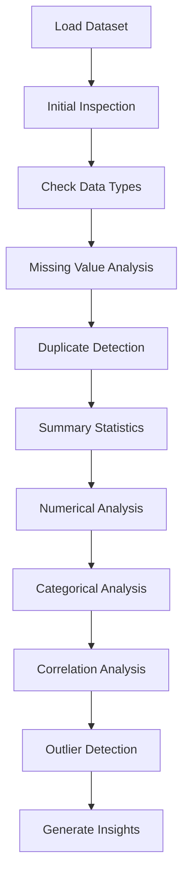

# Machine Learning Toolkit

A collection of reusable machine learning utilities, workflows, and notebooks developed while learning and applying machine learning concepts.

## Objective

The goal of this repository is to build a reusable toolkit for common machine learning tasks. Rather than focusing on individual datasets, it provides general-purpose workflows that can be adapted to different tabular datasets.

## Repository Structure




## Current Modules

### EDA

Initial tools for exploratory data analysis, including:

- Dataset overview
- Shape and data types
- Missing value analysis
- Duplicate detection
- Summary statistics
- Numerical feature distributions
- Categorical feature distributions
- Correlation analysis
- Outlier detection using boxplots

## Technologies Used

- Python
- Pandas
- NumPy
- Matplotlib
- Seaborn
- Scikit-learn
- Jupyter Notebook

## Future Plans

- Automated preprocessing pipeline
- Feature engineering utilities
- Model evaluation helpers
- Cross-validation workflows
- Feature selection techniques
- Model comparison templates

## How to Use

1. Clone the repository.

```bash
git clone https://github.com/<your-username>/machine-learning-toolkit.git
```

2. Install the required libraries.

```bash
pip install -r eda/requirements.txt
```

3. Open the notebook inside the desired module and execute the cells.

## License

This repository is intended for learning, experimentation, and portfolio purposes.
